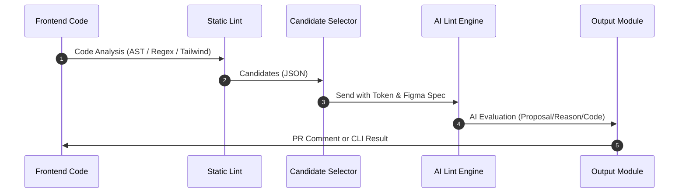
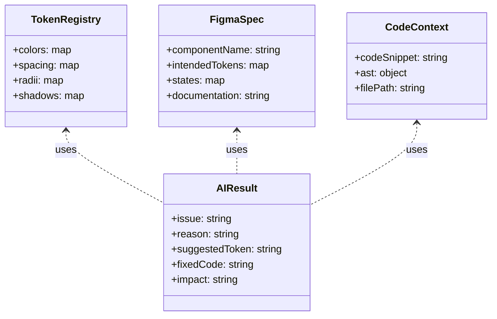
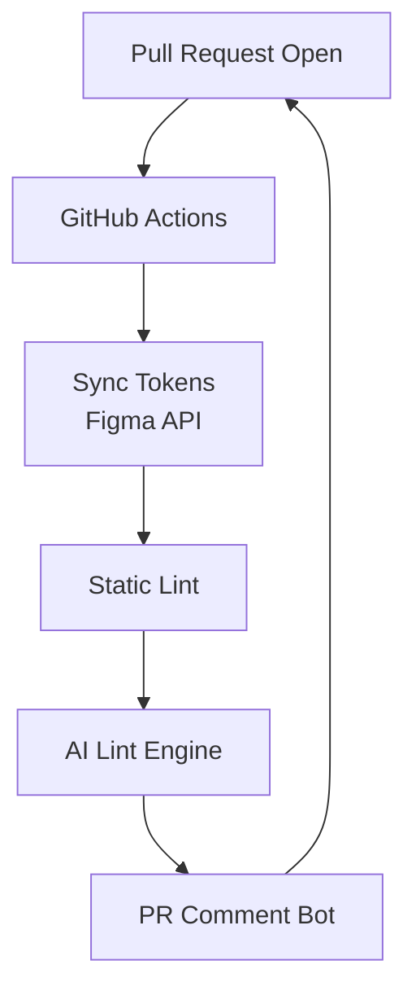

# AI Design System Linter - Architecture

> [!IMPORTANT]
> This document outlines the system architecture for the AI-powered Design System Linter, combining static analysis with AI-driven intent verification.

## ① Overall Architecture

```mermaid
flowchart LR
    A[Figma Design<br>• Variables<br>• Components] 
        --> B[Token Sync Layer<br>Token Extractor]
    B --> C[Token Registry(JSON)]
    C --> D[Static Lint Layer<br>ESLint/Tailwind/Stylelint]
    D --> E[AI Candidate Selector<br>Extract Deviations]

    E --> F[AI Lint Engine<br>LLM(Claude/GPT/Gemini)]
    F --> G[Lint Report<br>• Reason<br>• Token Proposal<br>• Fixed Code]

    G --> H[Output<br>• CLI<br>• GitHub PR Comment<br>• HTML Report]
```

## ② Data Flow: Static Lint → AI Lint



## ③ AI Internal Model



## ④ GitHub Action / CI Integration


